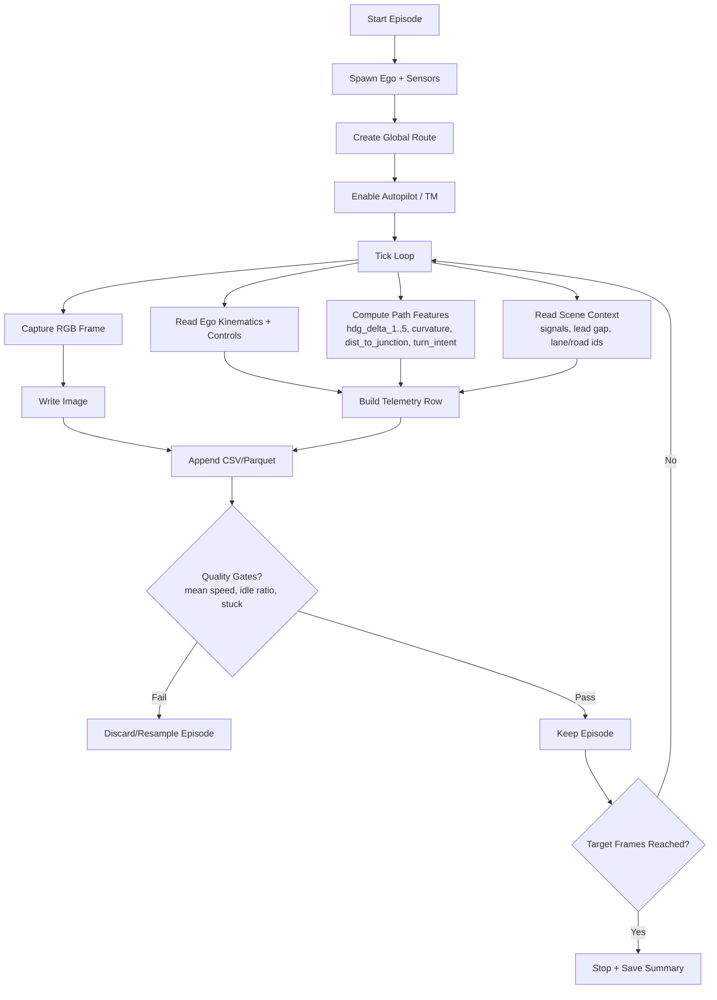
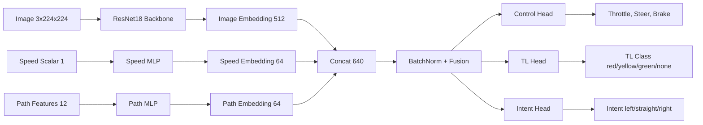
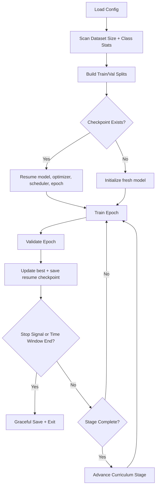
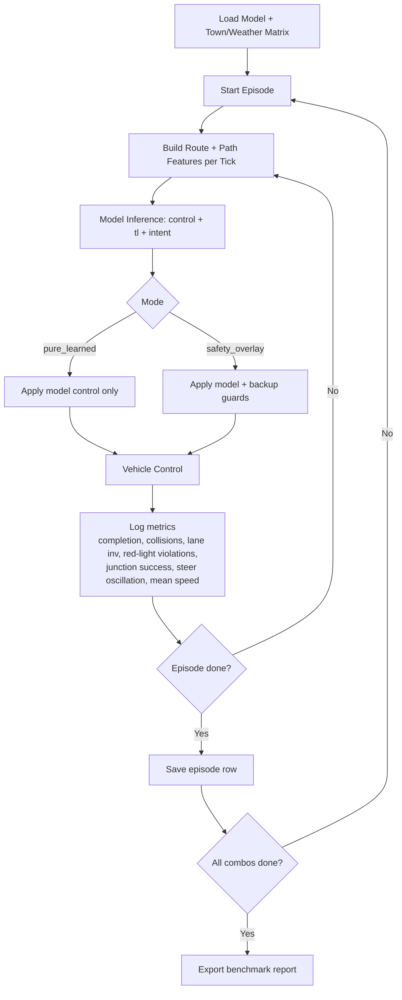

# Architecture Flows

## 1) Data Collector V2 Flow

```mermaid
flowchart TD
    A[Start Episode] --> B[Spawn Ego + Sensors]
    B --> C[Create Global Route]
    C --> D[Enable Autopilot / TM]
    D --> E[Tick Loop]
    E --> F[Capture RGB Frame]
    E --> G[Read Ego Kinematics + Controls]
    E --> H[Compute Path Features<br/>hdg_delta_1..5, curvature, dist_to_junction, turn_intent]
    E --> I[Read Scene Context<br/>signals, lead gap, lane/road ids]
    F --> J[Write Image]
    G --> K[Build Telemetry Row]
    H --> K
    I --> K
    J --> L[Append CSV/Parquet]
    K --> L
    L --> M{Quality Gates?<br/>mean speed, idle ratio, stuck}
    M -->|Fail| N[Discard/Resample Episode]
    M -->|Pass| O[Keep Episode]
    O --> P{Target Frames Reached?}
    P -->|No| E
    P -->|Yes| Q[Stop + Save Summary]
```

## 2) Path-Aware Model Architecture

```mermaid
flowchart LR
    A[Image 3x224x224] --> B[ResNet18 Backbone]
    B --> C[Image Embedding 512]
    D[Speed Scalar 1] --> E[Speed MLP]
    E --> F[Speed Embedding 64]
    G[Path Features 12] --> H[Path MLP]
    H --> I[Path Embedding 64]
    C --> J[Concat 640]
    F --> J
    I --> J
    J --> K[BatchNorm + Fusion]
    K --> L[Control Head]
    K --> M[TL Head]
    K --> N[Intent Head]
    L --> O[Throttle, Steer, Brake]
    M --> P[TL Class red/yellow/green/none]
    N --> Q[Intent left/straight/right]
```

## 3) Pausable Training Pipeline

```mermaid
flowchart TD
    A[Load Config] --> B[Scan Dataset Size + Class Stats]
    B --> C[Build Train/Val Splits]
    C --> D{Checkpoint Exists?}
    D -->|Yes| E[Resume model, optimizer, scheduler, epoch]
    D -->|No| F[Initialize fresh model]
    E --> G[Train Epoch]
    F --> G
    G --> H[Validate Epoch]
    H --> I[Update best + save resume checkpoint]
    I --> J{Stop Signal or Time Window End?}
    J -->|Yes| K[Graceful Save + Exit]
    J -->|No| L{Stage Complete?}
    L -->|No| G
    L -->|Yes| M[Advance Curriculum Stage]
    M --> G
```

## 4) Evaluation Dual-Mode Flow

```mermaid
flowchart TD
    A[Load Model + Town/Weather Matrix] --> B[Start Episode]
    B --> C[Build Route + Path Features per Tick]
    C --> D[Model Inference: control + tl + intent]
    D --> E{Mode}
    E -->|pure_learned| F[Apply model control only]
    E -->|safety_overlay| G[Apply model + backup guards]
    F --> H[Vehicle Control]
    G --> H
    H --> I[Log metrics<br/>completion, collisions, lane inv, red-light violations,<br/>junction success, steer oscillation, mean speed]
    I --> J{Episode done?}
    J -->|No| C
    J -->|Yes| K[Save episode row]
    K --> L{All combos done?}
    L -->|No| B
    L -->|Yes| M[Export benchmark report]
```
